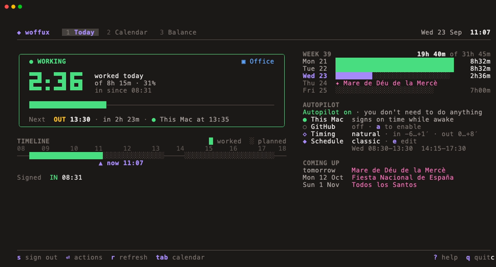
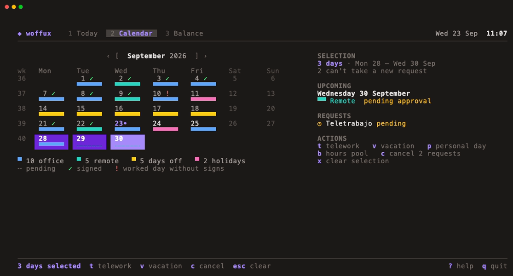
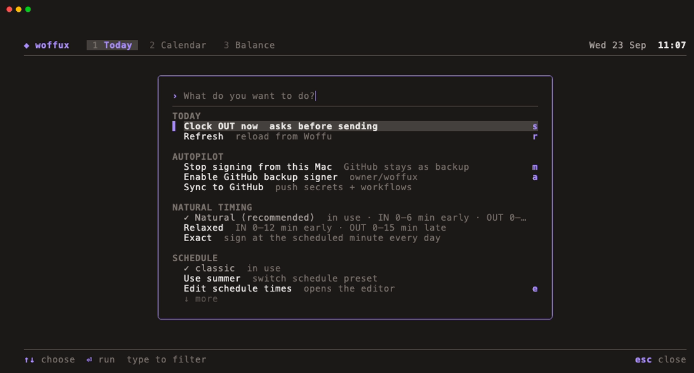
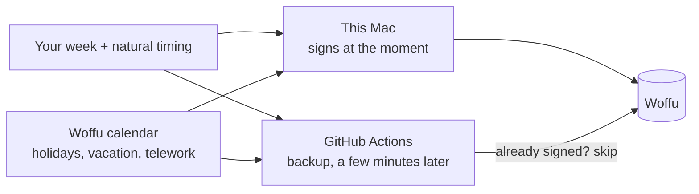

<p align="center">
  
</p>

<h1 align="center">woffux</h1>

<p align="center"><strong>Your <a href="https://www.woffu.com">Woffu</a> clock-ins, on autopilot.</strong><br>
Set your week once. woffux signs in and out for you, at natural moments, skipping holidays and days off — and shows you everything in a friendly terminal dashboard.</p>

<p align="center">
  <a href="https://github.com/ngavilan-dogfy/woffux/releases/latest"></a>
  <a href="https://github.com/ngavilan-dogfy/woffux/actions/workflows/release.yml"></a>
  
  <a href="LICENSE"></a>
</p>

<p align="center">
  
</p>

## Get started in two minutes

```bash
curl -fsSL https://raw.githubusercontent.com/ngavilan-dogfy/woffux/main/install.sh | sh
woffux
```

The first time you run `woffux`, a guided setup walks you through six short steps:

1. **Woffu account** — the email and password you already use. The password goes to your system keychain.
2. **Locations** — your office (usually found in Woffu automatically) and your home, for telework days.
3. **Work schedule** — pick a template or just type your week: `L-J 8:30-13:30 14:15-17:30, V 8-15`. Summer hours too.
4. **Natural timing** — sign a few minutes around the scheduled time instead of at the exact same second every day.
5. **Who signs** — this Mac, GitHub Actions, or both.
6. **Notifications** — optional Telegram message on every sign.

Nothing is signed during setup. At the end you see a summary and exactly when the next automatic sign will happen.

## What it does

- **Signs for you**: in and out, every working day, following your schedule.
- **Knows your calendar**: public holidays, vacation, absences and other days off in Woffu are skipped. On telework days it signs from home, on office days from the office.
- **Looks human**: *natural timing* lands every sign on a slightly different minute, leaning the safe way (in a bit early, out a bit late), so your day is never shorter than planned.
- **Never double-signs**: every signer works out the same moment and checks what's already registered before acting. Every sign is verified afterwards.
- **Summer hours on their own**: define your *jornada intensiva* once with dates. woffux switches on 1 July and back in September.
- **Requests in one keystroke**: telework, vacation, personal days and hours, from the calendar. It shows your balance and asks before sending.
- **Scriptable**: every query command speaks `--json` and TSV.

## The dashboard

Run `woffux`. Four screens, each answering one question:

| | |
|---|---|
| **Today** — *Where do I stand?* Working, on a break, done, or a holiday. Hours worked against today's target, the next sign and **who** will make it and when, a timeline of plan vs. reality, your week and the autopilot's health. |  |
| **Calendar** — the month at a glance: office, remote, time off, holidays, pending requests, and ✓ / ! for days signed or worked without signing. Select days (ranges too) and press `t` for telework or `v` for vacation. |  |
| **Schedule** — *when do I sign?* Your presets, the selected week drawn hour by hour, summer hours and the natural moments of the next days. `⏎` use · `e` edit as text with a live preview · `n` new from a template · `c` copy · `R` rename · `x` delete · `S` summer hours · `t` timing. | |
| **Command palette** — press `Enter`, `:` or `Ctrl+K` and type. Every action is there, with its shortcut. |  |

Anything that writes to Woffu (a sign, a request, a cancellation) asks first and tells you exactly what will be sent.

<details>
<summary><strong>Keyboard shortcuts</strong></summary>

| Key | Action |
|---|---|
| `Enter` / `:` / `Ctrl+K` | Command palette |
| `1` `2` `3` `4` / `Tab` | Today · Calendar · Schedule · Balance |
| `s` | Clock in / out now (asks first) |
| `r` | Refresh |
| `m` | Sign from this Mac on / off |
| `a` | GitHub backup signer on / off |
| `e` | Edit your week (Schedule tab) |
| `U` | Update woffux (shown when a new version exists) |
| `o` / `g` | Open Woffu / GitHub Actions |
| `?` | All shortcuts |
| `q` | Quit |

In the calendar: arrows or `hjkl` move, `[` `]` change month, `.` jumps to today, `space` selects, `Shift+arrows` selects a range, `t` `v` `p` `b` request telework / vacation / personal day / hours, `c` cancels requests, `Esc` clears the selection.

</details>

## Your schedule

<p align="center"></p>

The fastest way to describe a week is to write it:

```bash
woffux schedule set "mon-thu 8:30-13:30 14:15-17:30, fri 8-15"
woffux schedule set "L-V 9-14 15-18"            # Spanish day letters: L M X J V
woffux schedule set "weekdays 8-15"
```

- **Days**: `mon`…`fri`, `lunes`…`viernes`, `L M X J V`, ranges (`mon-thu`, `L-J`), lists (`L+X+V`), `weekdays`.
- **Times**: `8`, `8:30`, `8.30`, `0830` or `15h`.
- Days you don't mention are days off. Mistakes are explained ("times must go forward (01:00)").

Prefer a guided editor? `woffux schedule edit` offers templates (split day with short Friday, split all week, *intensiva*, early shift) and your saved presets. You can also write the week directly or go day by day. You always see the week drawn before saving.

**Summer hours.** Answer "yes" to *Different hours in summer?* and choose the dates (for example 1/7 → 31/8). woffux keeps two presets and switches between them by itself every year. The Mac signer follows the switch on its own; the GitHub backup picks it up after `woffux sync`, and the dashboard reminds you.

**Presets.** Keep several schedules and switch in a second: `woffux schedule save winter`, `woffux schedule load winter`, `woffux schedule list`, or from the palette in the dashboard.

`woffux schedule` shows everything: the week, timing, seasonal switches and the next change.

## Natural timing

Signing at 08:30:00 every single day is the pattern that makes automated clock-ins obvious. With natural timing each automatic sign happens at its own moment:

```
$ woffux timing
  Natural timing IN 0–6 min early · OUT 0–8 min late

  Mon 28  08:27  13:32  14:13  17:31
  Tue 29  08:30  13:33  14:13  17:31
  Wed 30  08:24  13:31  14:10  17:34
```

The rules are designed around what HR looks at:

- **Lean the safe way.** You clock in a little early rather than late, and out a little late rather than early.
- **Never short.** A work block is never shorter than planned: if the IN moves later, its OUT moves at least as much.
- **Human-shaped.** Moments cluster around the middle of the window instead of being uniformly random, and change every day.
- **Consistent.** Moments come from a private per-install seed and the date. This Mac, the GitHub backup and the dashboard all compute the same instant, so they never race each other.

| Preset | Window |
|---|---|
| `natural` (recommended) | IN up to 6 min early / 1 late · OUT up to 8 min late |
| `relaxed` | IN up to 12 min early / 2 late · OUT up to 15 min late |
| `exact` | the scheduled minute |

```bash
woffux timing natural     # or relaxed, exact
woffux timing custom      # set the four windows yourself
```

## Who signs: this Mac and/or GitHub

Something has to be awake at 08:30. woffux has two signers that cooperate:

| | This Mac (local agent) | GitHub Actions |
|---|---|---|
| Works when | the Mac is awake | always, even with the laptop closed |
| Punctuality | on the natural moment | GitHub timers often run late |
| Needs | macOS | a free GitHub account and the [`gh`](https://cli.github.com) CLI |
| Privacy | everything stays on your Mac | public fork (shows sign times); credentials as encrypted secrets |
| Turn on/off | `woffux agent on/off` or `m` | `woffux auto on/off` or `a` |

**Using both is safest.** The Mac signs first. The GitHub backup waits a few extra minutes and, seeing the sign already registered, does nothing. If the Mac was asleep, GitHub signs instead. Every scheduled sign can be retried for up to two hours if something failed.



GitHub setup is automatic: woffux forks this repo into your account, stores your credentials and locations as encrypted Actions secrets and keeps the workflow in sync. Like every fork of a public repo, the fork is public. Its workflow file shows your sign times, but never your credentials. After changing settings, `woffux sync` pushes them (the dashboard warns you when GitHub is out of date).

## Requests

```bash
woffux request                                        # pick the type (with your balance) and tick the days
woffux request -t Vacaciones -d 2026-10-05,2026-10-07 # or in one line
woffux requests                                       # pending, upcoming, past
woffux request cancel                                 # pick from your pending/upcoming requests
```

The interactive picker only lists working days without a request, so every option is one Woffu will accept, and it tells you how your balance will look afterwards before anything is sent.

Or use the calendar in the dashboard: select days, press `t` or `v`, confirm.

## Command reference

| Command | What it does |
|---|---|
| `woffux` | Dashboard (starts setup the first time) |
| `woffux setup` | Guided setup; run again any time to review it |
| `woffux status` / `today` | Today: working day, mode, signs |
| `woffux sign` | Clock in/out now (asks first in a terminal; `-y` skips) |
| `woffux schedule` · `set` · `edit` · `save` · `load` · `list` · `delete` · `push` | Your week and presets |
| `woffux timing [natural\|relaxed\|exact\|custom]` | Natural timing |
| `woffux agent on\|off\|status` | Sign from this Mac |
| `woffux auto on\|off` | GitHub backup signer |
| `woffux sync` | Push settings to GitHub |
| `woffux events` | Vacation days and hours left |
| `woffux calendar` · `holidays` · `history` · `requests` | Query Woffu |
| `woffux request` · `request cancel [id]` | Create / cancel requests (interactive lists) |
| `woffux config` · `config edit` | See / change any setting |
| `woffux open [docs\|calendar\|github]` | Open in the browser |
| `woffux update` | What's new, download with progress, verify, install (`-y` skips the question) |

Query commands print colours in a terminal, TSV when piped, and JSON with `--json`:

```bash
woffux events --json | jq '.[] | select(.name == "Vacaciones") | .available'
woffux today --json | jq '.slots[-1].out // "still clocked in"'
```

## FAQ

<details>
<summary><strong>Will it sign on holidays or when I'm on vacation?</strong></summary>

No. Before every automatic sign woffux asks Woffu whether today is a working day. Weekends, public holidays, approved absences and vacation are skipped. On telework days it signs with your home location.
</details>

<details>
<summary><strong>What if I sign by hand (phone, web)?</strong></summary>

woffux notices. A scheduled sign that's already registered is skipped, and it never signs "the wrong way" (for example OUT when you just clocked IN yourself).
</details>

<details>
<summary><strong>My Mac was asleep at 08:30.</strong></summary>

If GitHub is on, it signs. Otherwise the Mac catches up when it wakes, for up to two hours after the scheduled time. The dashboard shows *clock-in pending* in the meantime, and you can press `s` to sign right away.
</details>

<details>
<summary><strong><code>woffux update</code> says "GitHub API returned 403".</strong></summary>

That's GitHub's limit on anonymous requests (60 per hour per IP, often shared in offices and VPNs). Since v5.10.1 woffux falls back to the public download page automatically. On older versions, re-run the installer.
</details>

<details>
<summary><strong>Where is my data?</strong></summary>

Settings in `~/.woffux.yaml`, your password in the system keychain (macOS Keychain / Linux keyring). If you use the GitHub backup, credentials and locations are stored as encrypted Actions secrets in your fork. The fork itself is public, so its workflow shows your sign times but no personal data. Nothing is sent anywhere else. Telegram notifications are optional.
</details>

<details>
<summary><strong>How do I stop it or uninstall?</strong></summary>

`woffux agent off` and `woffux auto off` stop all automatic signing. To remove everything: `woffux agent off`, delete `~/.woffux.yaml` and the binary (`/usr/local/bin/woffux`), and, if you used GitHub, your `woffux` repository.
</details>

<details>
<summary><strong>Troubleshooting</strong></summary>

| Problem | Fix |
|---|---|
| Login fails after changing your Woffu password | `woffux config edit` → Password, then `woffux sync` |
| Signs from the wrong place | `woffux config edit` → Office / Home, then `woffux sync` |
| GitHub stopped signing | `woffux auto` to check; the Keepalive workflow prevents GitHub's 60-day pause |
| Dashboard says GitHub is outdated | `woffux sync` |
| `gh` missing or wrong account | `brew install gh`, `gh auth login` / `gh auth switch`, then `woffux sync` |
| Check what the Mac did | `woffux agent status` (recent activity) |
</details>

## Install options

<details>
<summary><strong>Download a binary</strong></summary>

From [Releases](https://github.com/ngavilan-dogfy/woffux/releases/latest): `woffux-darwin-arm64` (Apple Silicon), `woffux-darwin-amd64` (Intel Mac), `woffux-linux-amd64`, `woffux-linux-arm64`.

```bash
chmod +x woffux-darwin-arm64 && sudo mv woffux-darwin-arm64 /usr/local/bin/woffux
```
</details>

<details>
<summary><strong>Build from source (Go 1.25+)</strong></summary>

```bash
go install github.com/ngavilan-dogfy/woffux/cmd/woffux@latest
```
</details>

For the GitHub backup you also need [git](https://git-scm.com) and the [GitHub CLI](https://cli.github.com) (`brew install git gh`, then `gh auth login`). Setup checks for them and explains what's missing.

## Contributing

Issues and pull requests are welcome. See [CONTRIBUTING.md](CONTRIBUTING.md) for how to build, test and preview the dashboard without a Woffu account. Releases are cut automatically from Conventional Commits on `main`.

## License

[MIT](LICENSE). woffux is an independent project, not affiliated with Woffu.
