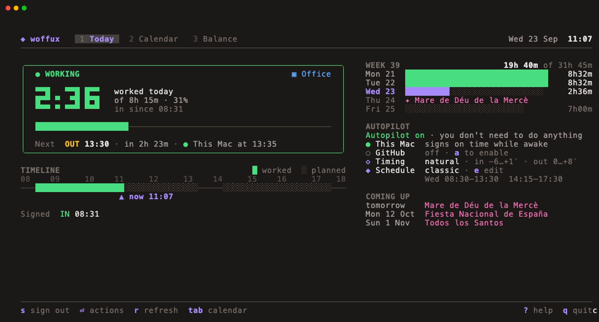
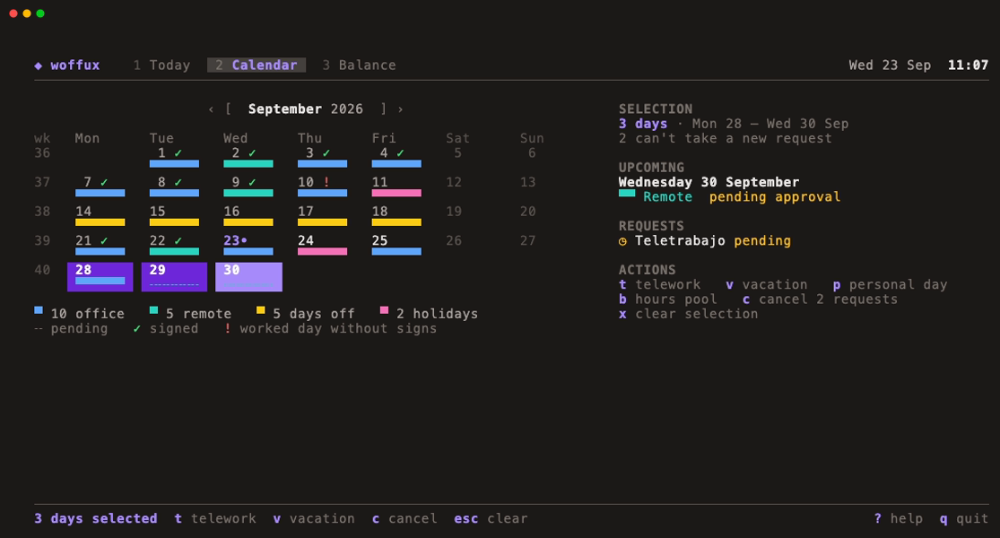
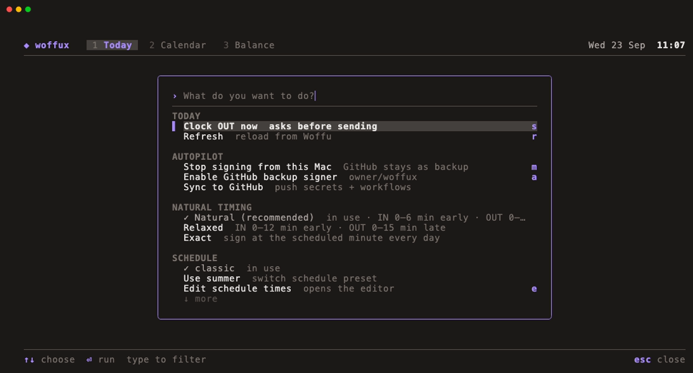
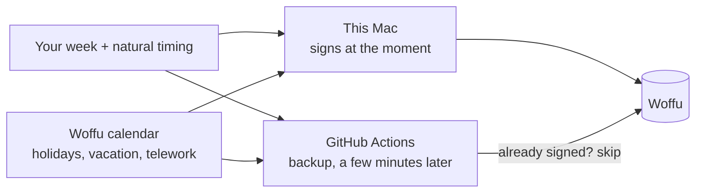

<p align="center">
  
</p>

<h1 align="center">woffux</h1>

<p align="center"><strong>Your <a href="https://www.woffu.com">Woffu</a> clock-ins, on autopilot.</strong><br>
Describe your week once. woffux signs in and out for you at natural moments, skips holidays and days off, and shows where you stand in a terminal dashboard.</p>

<p align="center">
  <a href="https://github.com/ngavilan-dogfy/woffux/releases/latest"></a>
  <a href="https://github.com/ngavilan-dogfy/woffux/actions/workflows/ci.yml"></a>
  
  <a href="LICENSE"></a>
</p>

<p align="center">
  
</p>

## Install

```bash
curl -fsSL https://raw.githubusercontent.com/ngavilan-dogfy/woffux/main/install.sh | sh
```

The installer picks the build for your OS and CPU, verifies it against the release's `checksums.txt`, and installs it to `~/.local/bin` without sudo — or updates the woffux you already have, where it is. It then offers, never assumes, to add that folder to your `PATH`, to install the `/woffux` skill if you use Claude Code, and to run the setup. Running it again updates in place; your settings are never touched.

<details>
<summary><strong>Other ways to install, and uninstalling</strong></summary>

- **A specific version or folder**: `curl -fsSL …/install.sh | WOFFUX_VERSION=v5.14.0 WOFFUX_INSTALL_DIR=~/bin sh`. `WOFFUX_NO_SETUP=1`, `WOFFUX_NO_SKILL=1` and `WOFFUX_NO_MODIFY_PATH=1` keep it from asking.
- **With Go** (1.25+): `go install github.com/ngavilan-dogfy/woffux/cmd/woffux@latest`
- **By hand**: download `woffux-<os>-<arch>` from the [latest release](https://github.com/ngavilan-dogfy/woffux/releases/latest) (`darwin-arm64` for Apple Silicon, `darwin-amd64` for Intel Macs, `linux-amd64`, `linux-arm64`), check it against `checksums.txt`, make it executable and put it on your `PATH`.
- **From source**: `make install` builds it and copies it to `~/.local/bin`.
- **Uninstall**: `woffux uninstall`. It stops both signers, deletes your credentials from GitHub, removes your settings, the keychain entry, caches, the skill and the binary — after asking, and with a *stop signing only* option.

</details>

## Set up

```bash
woffux setup        # or just `woffux`: the setup starts by itself the first time
```

<p align="center"></p>

Six short steps, about three minutes, and nothing is signed:

1. **Woffu account** — the email and password you use on Woffu. Your email comes filled in from git's work identity, and your company's Woffu address comes from Woffu itself. If your company signs in through single sign-on only, setup tells you why woffux can't work for you instead of reporting a wrong password.
2. **Locations** — your office (usually found in Woffu) and your home, for telework days: paste a Google Maps link or type the coordinates.
3. **Work schedule** — pick a template or type your week: `L-J 8:30-13:30 14:15-17:30, V 8-15`. Summer hours too, with their dates.
4. **Natural timing** — sign a few minutes around the scheduled time, never shortening your day, instead of at the same second every day.
5. **Who signs** — this Mac, GitHub Actions, or both.
6. **Notifications** — an optional Telegram message on every sign.

At the end you see a summary and exactly when the next automatic sign will happen. Run `woffux setup` again any time to review everything, and **`woffux doctor`** to check it all without changing anything.

## What it does

- **Signs for you**: in and out, every working day, following your schedule.
- **Knows your calendar**: public holidays, vacation, absences and other days off in Woffu are skipped. On telework days it signs from home, on office days from the office.
- **Looks human**: *natural timing* lands every sign on a slightly different minute, leaning the safe way (in a bit early, out a bit late), so your day is never shorter than planned.
- **Never double-signs**: every signer works out the same moment and checks what's already registered before acting. Every sign is verified afterwards.
- **Summer hours on their own**: define your *jornada intensiva* once with dates. woffux switches on 1 July and back in September.
- **Requests in one keystroke**: telework, vacation, personal days and hours, from the calendar. It shows your balance and asks before sending.
- **Scriptable**: every query speaks `--json` and TSV, and `woffux doctor --json` tells a script (or an agent) whether tomorrow's signs will happen.

## The dashboard

Run `woffux`. Four screens, each answering one question:

| | |
|---|---|
| **Today** — *Where do I stand?* Working, on a break, done, or a holiday. Hours worked against today's target, the next sign and **who** will make it and when, a timeline of plan vs. reality, your week and the autopilot's health. |  |
| **Calendar** — the month at a glance: office, remote, time off, holidays, pending requests, and ✓ / ! for days signed or worked without signing. Select days (ranges too) and press `t` for telework or `v` for vacation. |  |
| **Schedule** — *When do I sign?* Your presets, the selected week drawn hour by hour, summer hours and the natural moments of the next days. `⏎` use · `e` edit as text with a live preview · `n` new from a template · `c` copy · `R` rename · `x` delete · `S` summer hours · `t` timing. | |
| **Command palette** — press `Enter`, `:` or `Ctrl+K` and type. Every action is there, with its shortcut. |  |

Anything that writes to Woffu (a sign, a request, a cancellation) asks first and tells you exactly what will be sent.

<details>
<summary><strong>Keyboard shortcuts</strong></summary>

| Key | Action |
|---|---|
| `Enter` / `:` / `Ctrl+K` | Command palette |
| `1` `2` `3` `4` / `Tab` | Today · Calendar · Schedule · Balance |
| `s` | Clock in / out now (asks first) |
| `r` | Refresh |
| `m` | Sign from this Mac on / off |
| `a` | GitHub backup signer on / off |
| `e` | Edit your week (Schedule tab) |
| `U` | Update woffux (shown when a new version exists) |
| `o` / `g` | Open Woffu / GitHub Actions |
| `?` | All shortcuts |
| `q` | Quit |

In the calendar: arrows or `hjkl` move, `[` `]` change month, `.` jumps to today, `space` selects, `Shift+arrows` selects a range, `t` `v` `p` `b` request telework / vacation / personal day / hours, `c` cancels requests, `Esc` clears the selection.

</details>

## Your schedule

<p align="center"></p>

The fastest way to describe a week is to write it:

```bash
woffux schedule set "mon-thu 8:30-13:30 14:15-17:30, fri 8-15"
woffux schedule set "L-V 9-14 15-18"            # Spanish day letters: L M X J V
woffux schedule set "weekdays 8-15"
```

- **Days**: `mon`…`fri`, `lunes`…`viernes`, `L M X J V`, ranges (`mon-thu`, `L-J`), lists (`L+X+V`), `weekdays`.
- **Times**: `8`, `8:30`, `8.30`, `0830` or `15h`.
- Days you don't mention are days off. Mistakes are explained ("times must go forward (01:00)").

Prefer a guided editor? `woffux schedule edit` offers templates (split day with short Friday, split all week, *intensiva*, early shift) and your saved presets, or lets you write the week or go day by day. You always see the week drawn before saving.

**Summer hours.** Answer "yes" to *Different hours in summer?* and choose the dates (for example 1/7 → 31/8). woffux keeps two presets and switches between them by itself every year. This Mac's signer follows the switch on its own; the GitHub backup picks it up after `woffux sync`, and the dashboard reminds you.

**Presets.** Keep several schedules and switch in a second: `woffux schedule save winter`, `woffux schedule load winter`, `woffux schedule list`, or from the palette in the dashboard.

`woffux schedule` shows everything: the week, timing, seasonal switches and the next change.

## Natural timing

Signing at 08:30:00 every single day is the pattern that makes automated clock-ins obvious. With natural timing each automatic sign happens at its own moment:

```
$ woffux timing
  Natural timing IN 0–6 min early · OUT 0–8 min late

  Mon 28  08:27  13:32  14:13  17:31
  Tue 29  08:30  13:33  14:13  17:31
  Wed 30  08:24  13:31  14:10  17:34
```

The rules are designed around what HR looks at:

- **Lean the safe way.** You clock in a little early rather than late, and out a little late rather than early.
- **Never short.** A work block is never shorter than planned: if the IN moves later, its OUT moves at least as much.
- **Human-shaped.** Moments cluster around the middle of the window instead of being uniformly random, and change every day.
- **Consistent.** Moments come from a private per-install seed and the date. This Mac, the GitHub backup and the dashboard all compute the same instant, so they never race each other.

| Preset | Window |
|---|---|
| `natural` (recommended) | IN up to 6 min early / 1 late · OUT up to 8 min late |
| `relaxed` | IN up to 12 min early / 2 late · OUT up to 15 min late |
| `exact` | the scheduled minute |

```bash
woffux timing natural     # or relaxed, exact
woffux timing custom      # set the four windows yourself
```

## Who signs: this Mac and/or GitHub

Something has to be awake at 08:30. woffux has two signers that cooperate:

| | This Mac (local agent) | GitHub Actions |
|---|---|---|
| Works when | the Mac is awake | always, even with the laptop closed |
| Punctuality | on the natural moment | GitHub timers often run late |
| Needs | macOS | a free GitHub account and the [`gh`](https://cli.github.com) CLI |
| Privacy | everything stays on your Mac | a public fork (shows your sign times); credentials as encrypted secrets |
| Turn on/off | `woffux agent on/off` or `m` | `woffux auto on/off` or `a` |

**Using both is safest.** The Mac signs first. The GitHub backup waits a few extra minutes and, seeing the sign already registered, does nothing. If the Mac was asleep, GitHub signs instead. A scheduled sign that couldn't happen is retried for up to two hours.


```mermaid
flowchart LR
  S[Your week + natural timing] --> M[This Mac<br/>signs at the moment]
  S --> G[GitHub Actions<br/>backup, a few minutes later]
  M --> W[(Woffu)]
  G -- "already signed? skip" --> W
  C[Woffu calendar<br/>holidays, vacation, telework] --> M
  C --> G
```

GitHub setup is automatic: woffux forks this repository into your account, stores your credentials and locations as encrypted Actions secrets and keeps the workflow in sync. Like every fork of a public repository, the fork is public: its workflow file shows your sign times, never your credentials. After changing settings, `woffux sync` pushes them — the dashboard and `woffux doctor` tell you when GitHub is out of date.

## Requests

```bash
woffux request                                        # pick the type (with your balance) and tick the days
woffux request -t Vacaciones -d 2026-10-05,2026-10-07 # or in one line
woffux requests                                       # pending, upcoming, past
woffux request cancel                                 # pick from your pending and upcoming requests
```

The interactive picker only lists working days without a request, so every option is one Woffu will accept, and it shows how your balance will look before anything is sent. Or use the calendar in the dashboard: select days, press `t` or `v`, confirm.

## For agents

- **`woffux doctor --json`** answers "will tomorrow's signs happen?": both signers, the saved password, the GitHub workflow and secrets, and the next automatic sign — each problem with the command that fixes it.
- **Every query speaks JSON**: `status`, `today`, `calendar`, `events`, `requests`, `history`, `holidays`, `schedule`, `whoami` take `--json`.
- **Writes are explicit**: signing, requests and cancellations are separate commands, and the skill tells Claude to ask before any of them.

### Claude Code

```bash
woffux skill install
```

Installs the `/woffux` skill: *"have I signed today?"*, *"how many vacation days do I have left?"*, *"request telework for next Tuesday and Thursday"*. It ships inside the binary and is refreshed by `woffux update`. [AGENTS.md](AGENTS.md) is the same guidance for any other agent.

## Command reference

| Command | What it does |
|---|---|
| `woffux` | Dashboard (starts setup the first time) |
| `woffux setup` | Guided setup; run it again any time to review it |
| `woffux status` / `today` | Today: working day, mode, signs |
| `woffux sign` | Clock in/out now (asks first in a terminal; `-y` skips) |
| `woffux schedule` · `set` · `edit` · `save` · `load` · `list` · `delete` · `push` | Your week and presets |
| `woffux timing [natural\|relaxed\|exact\|custom]` | Natural timing |
| `woffux agent on\|off\|status` | Sign from this Mac |
| `woffux auto on\|off` | GitHub backup signer |
| `woffux sync` | Push settings to GitHub |
| `woffux events` | Vacation days and hours left |
| `woffux calendar` · `holidays` · `history` · `requests` | Query Woffu |
| `woffux request` · `request cancel [id]` | Create / cancel requests (interactive lists) |
| `woffux config` · `config edit` | See / change any setting (a new password is checked with Woffu first) |
| `woffux open [docs\|calendar\|github]` | Open in the browser |
| `woffux doctor` | Check everything, with a fix for each problem |
| `woffux update` | What's new, download, verify, install (`--check` only looks, `-y` doesn't ask) |
| `woffux version` | Version, commit and where the binary lives |
| `woffux skill install\|status\|remove` | The Claude Code skill |
| `woffux uninstall` | Stop signing, or remove woffux completely |

## Scripting

- **stdout carries data only.** In a terminal, colors and layout; when piped, tab-separated values with a header row; with `--json`, JSON and nothing else.
- **Failures** exit with 1 and go to stderr as one line — `{"error": "…"}` with `--json`. `woffux doctor` exits with 1 only when a check fails, not on warnings.
- **Retries** are built in for reads (timeouts, rate limits, Woffu 5xx). A sign is never retried blindly: it's checked and verified instead.

```bash
woffux events --json | jq '.[] | select(.name == "Vacaciones") | .available'
woffux today --json | jq '.slots[-1].out // "still clocked in"'
woffux doctor --json | jq -r '.checks[] | select(.status == "fail") | "\(.detail) → \(.fix)"'
```

JSON field names are treated as a public interface: renaming or removing one is a breaking change and ships as a new major version.

## Configuration

| Path | Contents |
|---|---|
| `~/.woffux.yaml` | Settings: email, company address, locations, schedule and presets, timing, GitHub repository, Telegram (mode 0600) |
| System keychain, service `woffux` | Your Woffu password (macOS Keychain, or the Secret Service on Linux) |
| `<OS cache dir>/woffux/` | Woffu sessions until they expire, and the daily update check |
| `~/Library/LaunchAgents/dev.woffux.agent.plist` | This Mac's signer (macOS) |
| `~/Library/Logs/woffux-agent.log` | What this Mac's signer did, one line per run |
| `~/.claude/skills/woffux/` | The Claude Code skill, if installed |

| Variable | Effect |
|---|---|
| `WOFFU_URL`, `WOFFU_COMPANY_URL`, `WOFFU_EMAIL`, `WOFFU_PASSWORD` | Sign in without a settings file (what the GitHub signer uses) |
| `WOFFU_LATITUDE`, `WOFFU_LONGITUDE`, `WOFFU_HOME_LATITUDE`, `WOFFU_HOME_LONGITUDE` | Office and home locations, with the variables above |
| `WOFFUX_TIMING` | Natural-timing windows and seed for that setup (`off` for exact) |
| `TELEGRAM_BOT_TOKEN`, `TELEGRAM_CHAT_ID` | Notifications, with the variables above |
| `WOFFUX_NO_UPDATE_NOTIFIER=1` | Don't mention new releases after commands |

## Security and privacy

- **Your password** lives in the system keychain, never in a file; **your settings file** is readable only by you (woffux makes it so if it isn't). With the GitHub backup, your credentials and locations are encrypted [Actions secrets](https://docs.github.com/actions/security-for-github-actions/security-guides/using-secrets-in-github-actions) in your repository, which only its own workflows can read.
- **woffux talks to** Woffu, GitHub (releases and, for the backup, your repository through `gh`), Telegram if you turn notifications on, and OpenStreetMap's Nominatim during setup only when Woffu doesn't know where your office is. There is no telemetry.
- **The GitHub backup is a public fork.** Its workflow file shows your sign times and timezone. If that's not acceptable, let only this Mac sign.
- **Downloads are verified**: the installer and `woffux update` check every binary against the release's SHA-256 checksums, and the new binary must run before it replaces the old one.
- **Nothing is signed or sent behind your back.** Setup signs nothing. In a terminal, `woffux sign` asks first, and so do requests picked from a list or the calendar; the one-line forms meant for scripts (`woffux sign -y`, `woffux request -t … -d …`) send right away.

To report a vulnerability, see [SECURITY.md](SECURITY.md).

## Troubleshooting

`woffux doctor` checks the install, your settings and password, this Mac's signer, the GitHub backup and the next sign, and prints a fix for each problem.

| You see | Do this |
|---|---|
| `command not found: woffux` | Open a new terminal. If it persists, add `export PATH="$HOME/.local/bin:$PATH"` to `~/.zshrc` or `~/.bashrc`. |
| Login fails after changing your Woffu password | `woffux config edit` → Password, then `woffux sync` if GitHub signs too |
| *Your company signs in to Woffu with … only* | Your company turned Woffu passwords off (single sign-on only): woffux can't sign in until your Woffu admin enables a password for you. |
| Signs from the wrong place | `woffux config edit` → Office / Home, then `woffux sync` |
| A sign didn't happen | `woffux doctor`, then `woffux agent status` for this Mac's recent runs |
| GitHub stopped signing | `woffux doctor`; the Keepalive workflow prevents GitHub's 60-day pause |
| The dashboard says GitHub is outdated | `woffux sync` |
| `gh` missing or signed in to the wrong account | `brew install gh`, `gh auth login` / `gh auth switch`, then `woffux sync` |

<details>
<summary><strong>FAQ</strong></summary>

**Will it sign on holidays or when I'm on vacation?** No. Before every automatic sign woffux asks Woffu whether today is a working day. Weekends, public holidays, approved absences and vacation are skipped. On telework days it signs with your home location.

**What if I sign by hand (phone, web)?** woffux notices. A scheduled sign that's already registered is skipped, and it never signs "the wrong way" (for example OUT when you just clocked IN yourself).

**My Mac was asleep at 08:30.** If GitHub is on, it signs. Otherwise the Mac catches up when it wakes, for up to two hours after the scheduled time. The dashboard shows *clock-in pending* in the meantime, and `s` signs right away.

**How do I pause it for a while?** `woffux agent off` and `woffux auto off` (or `woffux uninstall --stop-only`). `woffux agent on` / `woffux auto on` resume it.

</details>

## Updating

```bash
woffux update
```

Shows what's new, downloads the release for your machine, verifies its checksum and that it runs, and only then replaces the current binary. If this Mac signs for you, its signer switches to the new version too. When a newer release exists, commands run in a terminal mention it — checked in the background, at most once a day. The GitHub backup always runs the latest release.

## Contributing

`make check` runs gofmt, vet, the tests and a build; `make preview` renders every dashboard screen with made-up data, no Woffu account needed. Releases are cut automatically from [Conventional Commits](https://www.conventionalcommits.org) on `main`. Start with [CONTRIBUTING.md](CONTRIBUTING.md); [ARCHITECTURE.md](ARCHITECTURE.md) maps the code and the decisions behind it.

## License

[MIT](LICENSE). woffux is an independent project, not affiliated with Woffu.
